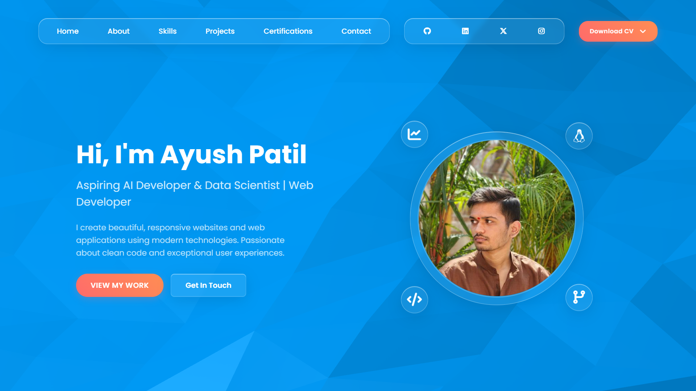

# Personal Portfolio Website

A modern, responsive personal portfolio website showcasing projects, skills, and professional experience. Built with HTML, CSS, and JavaScript featuring a beautiful glassmorphism design with animated backgrounds.

## 🌟 Features

- **Modern Glassmorphism Design**: Beautiful glass-like components with backdrop blur effects
- **Responsive Layout**: Optimized for all device sizes (desktop, tablet, mobile)
- **Interactive Animations**: Smooth transitions, hover effects, and floating animations
- **Animated Background**: Dynamic wave animation using Vanta.js
- **Typewriter Effect**: Animated text introduction
- **Mobile Navigation**: Hamburger menu for mobile devices
- **Professional Sections**:
  - Hero section with personal introduction
  - About section with education and statistics
  - Skills showcase with technology categories
  - Projects portfolio with descriptions and links
  - Certifications display
  - Contact section with social links

## 🚀 Live Demo

[View Live Portfolio](https://ayushpatil0810.github.io) <!-- Update with your actual URL -->

## 📸 Screenshots



## 🛠️ Technologies Used

- **Frontend**: HTML5, CSS3, JavaScript (ES6+)
- **Libraries**: 
  - Three.js (3D graphics)
  - Vanta.js (animated backgrounds)
  - Font Awesome (icons)
  - Google Fonts (Poppins)
- **Design**: Glassmorphism, CSS Grid, Flexbox
- **Responsive**: Mobile-first design approach

## 📁 Project Structure

```
portfolio-website/
│
├── index.html              # Main HTML file
├── style.css               # Stylesheet with glassmorphism design
├── script.js               # JavaScript for interactions and animations
├── README.md               # Project documentation
│
└── images/                 # Image assets
    ├── avatar.jpg          # Profile picture
    ├── logo.png            # Logo/brand image
    ├── screenshot.png      # Portfolio screenshot
    └── projects/           # Project screenshots
        ├── file-organizer-script.png
        ├── flask-blog.png
        ├── github-profile-roaster.png
        ├── pdf-narrator.png
        └── personal-portfolio.png
```

## 🎨 Design Features

### Glassmorphism Effects
- Semi-transparent backgrounds with backdrop blur
- Subtle borders and shadows
- Hover animations and scaling effects

### Color Scheme
- Primary gradient: Blue to purple (`#667eea` to `#764ba2`)
- Accent colors: Orange to red gradient (`#ff6b6b` to `#ff8e53`)
- Text: White with various opacity levels

### Typography
- Font family: Poppins (Google Fonts)
- Responsive font sizes
- Proper contrast for readability

## 🚀 Getting Started

### Prerequisites
- A modern web browser
- Basic knowledge of HTML, CSS, and JavaScript (for customization)

### Installation

1. **Clone the repository**
   ```bash
   git clone https://github.com/ayushpatil0810/portfolio-website.git
   cd portfolio-website
   ```

2. **Open in browser**
   - Simply open `index.html` in your preferred web browser
   - Or use a local server for better development experience:
   
   ```bash
   # Using Python
   python -m http.server 8000
   
   # Using Node.js (if you have live-server installed)
   npx live-server
   ```

3. **View the website**
   - Navigate to `http://localhost:8000` (if using local server)
   - Or directly open the `index.html` file

## ⚙️ Customization

### Personal Information
Update the following in `index.html`:
- Profile picture (`./images/avatar.jpg`)
- Name and title in hero section
- About section content
- Skills and technologies
- Project information
- Contact details and social links

### Styling
Modify `style.css` to:
- Change color schemes
- Adjust glassmorphism effects
- Update responsive breakpoints
- Customize animations

### Functionality
Enhance `script.js` to:
- Modify typewriter animation speed
- Add new interactive features
- Update navigation behavior

## 📱 Responsive Design

The website is fully responsive with breakpoints for:
- **Desktop**: 1200px and above
- **Laptop**: 1024px - 1199px
- **Tablet**: 768px - 1023px
- **Mobile**: Below 768px

## 🌐 Browser Support

- Chrome (recommended)
- Firefox
- Safari
- Edge
- Mobile browsers (iOS Safari, Chrome Mobile)

## 📝 Sections Overview

1. **Navigation**: Fixed glass navigation with hamburger menu for mobile
2. **Hero**: Animated introduction with typewriter effect and profile image
3. **About**: Personal description with education and achievement statistics
4. **Skills**: Technology categories with icons and hover effects
5. **Projects**: Portfolio showcase with project cards and descriptions
6. **Certifications**: Professional certifications display
7. **Contact**: Contact information and social media links
8. **Footer**: Additional information and credits

## 🤝 Contributing

1. Fork the repository
2. Create a feature branch (`git checkout -b feature/AmazingFeature`)
3. Commit your changes (`git commit -m 'Add some AmazingFeature'`)
4. Push to the branch (`git push origin feature/AmazingFeature`)
5. Open a Pull Request

## 📄 License

This project is licensed under the MIT License - see the [LICENSE](LICENSE) file for details.

## 👤 Author

**Ayush Patil**
- GitHub: [@ayushpatil0810](https://github.com/ayushpatil0810)
- LinkedIn: [Ayush Patil](https://linkedin.com/in/ayushpatil0810)
- Twitter: [@ayushpatil0810](https://twitter.com/ayushpatil0810)
- Instagram: [@ayushpatil0810](https://instagram.com/ayushpatil0810)

## 🙏 Acknowledgments

- [Vanta.js](https://www.vantajs.com/) for animated backgrounds
- [Three.js](https://threejs.org/) for 3D graphics support
- [Font Awesome](https://fontawesome.com/) for icons
- [Google Fonts](https://fonts.google.com/) for typography
- Design inspiration from modern glassmorphism trends

## 📊 Performance

The website is optimized for:
- Fast loading times
- Smooth animations
- Minimal JavaScript bundle size
- Optimized images and assets

---

⭐ **Star this repository if you found it helpful!**

For any questions or suggestions, feel free to open an issue or reach out through the contact section of the portfolio.
